# IMC Prosperity Trading Terminal

A professional-grade, Bloomberg-style trading terminal and research platform purpose-built for the **IMC Prosperity** algorithmic trading competition. Replay historical market data tick-by-tick, develop and backtest trading strategies against realistic order book snapshots, visualise performance with 200+ configurable technical indicators, and analyse execution quality &mdash; all from an interactive, keyboard-driven, multi-panel workspace.

**Built with:** Python FastAPI backend (data processing, strategy execution, backtesting) + React TypeScript frontend (Zustand state management, TradingView Lightweight Charts, resizable panel layouts, real-time WebSocket streaming).

### Live Strategy Replay

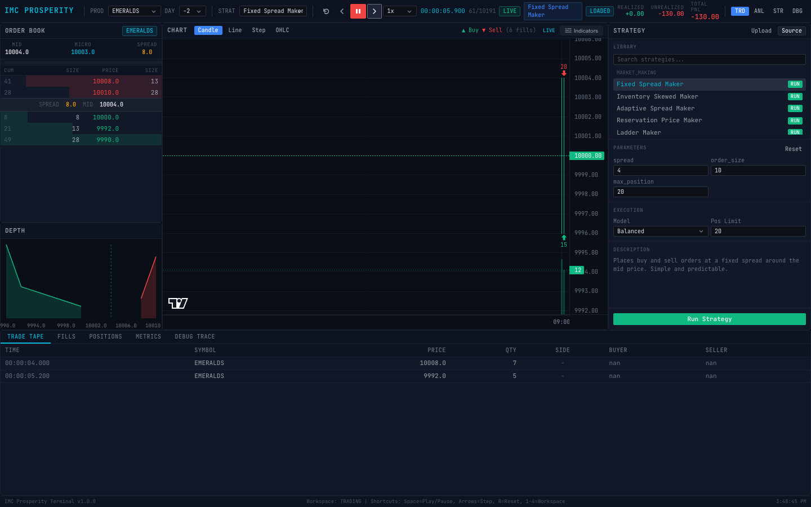

*Real-time strategy execution with order book, candlestick chart with fill markers, PnL in header, depth chart, strategy parameters, and trade tape.*

---

## Table of Contents

- [Architecture Overview](#architecture-overview)
- [Quick Start](#quick-start)
  - [Prerequisites](#prerequisites)
  - [Backend Setup](#backend-setup)
  - [Frontend Setup](#frontend-setup)
  - [Open the Terminal](#open-the-terminal)
- [Complete User Guide](#complete-user-guide)
  - [1. Understanding the Interface](#1-understanding-the-interface)
  - [2. Loading Market Data](#2-loading-market-data)
  - [3. Starting a Market Replay](#3-starting-a-market-replay)
  - [4. Using the Order Book Panel](#4-using-the-order-book-panel)
  - [5. Using the Price Chart](#5-using-the-price-chart)
  - [6. Adding Technical Indicators](#6-adding-technical-indicators)
  - [7. Selecting and Running a Strategy](#7-selecting-and-running-a-strategy)
  - [8. Real-Time Strategy Replay (Live Mode)](#8-real-time-strategy-replay-live-mode)
  - [9. Reading the PnL Header](#9-reading-the-pnl-header)
  - [10. Viewing Positions](#10-viewing-positions)
  - [11. Viewing Fills](#11-viewing-fills)
  - [12. Running a Backtest](#12-running-a-backtest)
  - [13. Analysing Backtest Metrics](#13-analysing-backtest-metrics)
  - [14. Using the Debug Trace](#14-using-the-debug-trace)
  - [15. Uploading a Custom Strategy](#15-uploading-a-custom-strategy)
  - [16. Switching Workspaces](#16-switching-workspaces)
  - [17. Keyboard Shortcuts](#17-keyboard-shortcuts)
- [Workspace Layouts](#workspace-layouts)
- [Technical Indicators (200+)](#technical-indicators-200)
- [Built-in Strategy Library (17 Strategies)](#built-in-strategy-library-17-strategies)
- [Execution Models](#execution-models)
- [Data Format Reference](#data-format-reference)
- [API Reference](#api-reference)
- [Strategy Interface (Writing Custom Strategies)](#strategy-interface-writing-custom-strategies)
- [Project Structure](#project-structure)
- [Tech Stack](#tech-stack)
- [Troubleshooting](#troubleshooting)
- [Limitations](#limitations)
- [How to Extend](#how-to-extend)
- [License](#license)

---

## Architecture Overview

```
┌─────────────────────────────┐          HTTP REST + WebSocket         ┌────────────────────────────────┐
│                             │  ◄──────────────────────────────────►  │                                │
│     React Frontend          │         /api/* endpoints               │      FastAPI Backend           │
│     (TypeScript + Vite)     │         /api/ws/replay streaming       │      (Python 3.11+)            │
│                             │                                        │                                │
│  ┌────────────────────────┐ │                                        │  ┌───────────────────────────┐ │
│  │ Zustand State Stores   │ │                                        │  │ Data Loader + Normalizer  │ │
│  │ • Dataset Store        │ │                                        │  │ • CSV parsing (;/,)       │ │
│  │ • Replay Store         │ │                                        │  │ • OHLCV aggregation       │ │
│  │ • Backtest Store       │ │                                        │  │ • Event stream building   │ │
│  │ • Strategy Store       │ │                                        │  ├───────────────────────────┤ │
│  │ • UI Store             │ │                                        │  │ Replay Engine             │ │
│  ├────────────────────────┤ │                                        │  │ • Tick-by-tick stepping   │ │
│  │ Panels                 │ │                                        │  │ • Forward/backward/seek   │ │
│  │ • Order Book (ladder)  │ │                                        │  │ • Strategy integration    │ │
│  │ • Depth Chart          │ │                                        │  ├───────────────────────────┤ │
│  │ • Price Chart (OHLCV)  │ │                                        │  │ Execution Engine          │ │
│  │ • Trade Tape           │ │                                        │  │ • 3 execution models      │ │
│  │ • Strategy Panel       │ │                                        │  │ • Fill simulation         │ │
│  │ • Metrics Panel        │ │                                        │  ├───────────────────────────┤ │
│  │ • Positions Panel      │ │                                        │  │ Backtest Engine           │ │
│  │ • Fills Panel          │ │                                        │  │ • Full run orchestration  │ │
│  │ • Debug Trace Panel    │ │                                        │  ├───────────────────────────┤ │
│  ├────────────────────────┤ │                                        │  │ Sandbox Runner            │ │
│  │ 200+ Technical         │ │                                        │  │ • User strategy isolation │ │
│  │ Indicators (client)    │ │                                        │  │ • Timeout enforcement     │ │
│  └────────────────────────┘ │                                        │  ├───────────────────────────┤ │
│                             │                                        │  │ Strategy Registry         │ │
│  Lightweight Charts (TV)    │                                        │  │ • 17 built-in strategies  │ │
│  react-resizable-panels     │                                        │  │ • Upload support          │ │
│                             │                                        │  ├───────────────────────────┤ │
└─────────────────────────────┘                                        │  │ SQLite Storage            │ │
                                                                       │  └───────────────────────────┘ │
                                                                       └────────────────────────────────┘
```

**Data flow:**
1. Backend loads CSV files (price snapshots + trade prints) on startup
2. Frontend connects and fetches available products/days
3. User starts a replay &rarr; backend streams tick-by-tick events
4. Each tick updates the order book, chart, trade tape, and strategy state
5. Strategy fills, positions, and PnL are computed in real-time and sent to the frontend
6. All panels update live as the replay advances

---

## Quick Start

### Prerequisites

| Requirement | Minimum Version |
|---|---|
| Python | 3.11+ |
| Node.js | 18+ |
| npm | Comes with Node.js |

### Backend Setup

```bash
# Navigate to the backend directory
cd backend

# Install Python dependencies
pip install -r requirements.txt

# Start the API server
python -m uvicorn app.main:app --reload
```

The backend starts on **http://localhost:8000**. You should see:

```
INFO:     Uvicorn running on http://127.0.0.1:8000
INFO:     Started reloader process
INFO:     Application startup complete.
```

**Verify it's running:**

```bash
curl http://localhost:8000/api/health
# Expected: {"status":"ok"}
```

### Frontend Setup

```bash
# Navigate to the frontend directory
cd frontend

# Install Node.js dependencies
npm install

# Start the development server
npm run dev
```

The frontend starts on **http://localhost:3000** (or the next available port). You should see:

```
VITE v5.x.x  ready in XXXms

➜  Local:   http://localhost:3000/
```

### Open the Terminal

1. Open **http://localhost:3000** in your browser (Chrome or Firefox recommended)
2. The terminal automatically connects to the backend
3. Sample data from `sample_data/` is auto-loaded on startup
4. You should see the **Trading** workspace with the header bar, order book (left), chart (center), and strategy panel (right)

If you see a red error banner saying "Connection failed", ensure the backend is running on port 8000.

### Custom Backend URL

If your backend runs on a different host/port:

```bash
VITE_API_BASE_URL=https://your-backend-host/api \
VITE_WS_BASE_URL=wss://your-backend-host/api \
npm run dev
```

---

## Complete User Guide

This section walks through **every feature** of the terminal step by step.

### 1. Understanding the Interface

When you first open the terminal, you see the **Trading Workspace** layout:

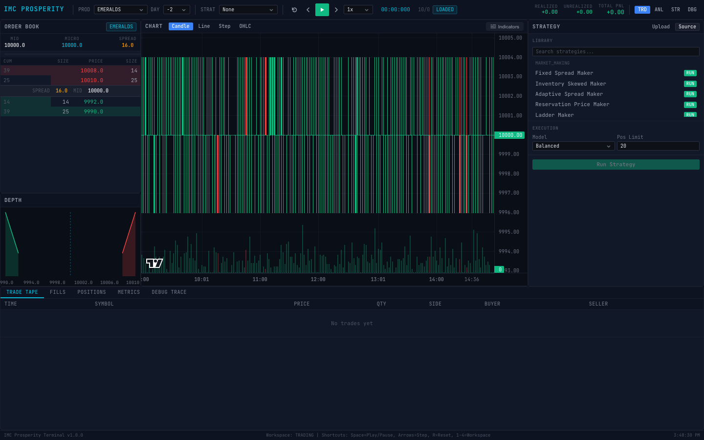

*The Trading workspace: order book (left), candlestick chart with volume (center), strategy panel (right), tabbed bottom panel.*

```
┌──────────────────────────────────────────────────────────────────────────────┐
│  HEADER BAR                                                                  │
│  [PROD ▼] [DAY ▼] [STRAT ▼]  ⏮ ◀ ▶ ▸  [1x ▼]  00:00:00.000  [LOADED]    │
│  Realized: +0.00  Unrealized: +0.00  Total: +0.00   [TRD] [ANL] [STR] [DBG]│
├───────────┬───────────────────────────────────────────┬──────────────────────┤
│ ORDER BOOK│           PRICE CHART                     │ STRATEGY PANEL       │
│           │   (Candlestick / Line / Step / OHLC)      │  Library             │
│  BID  ASK │   + Volume bars                           │  Parameters          │
│  levels   │   + Indicator overlays                    │  Execution config    │
│           │   + Fill markers (▲ Buy / ▼ Sell)         │  Description         │
│           │                                           │  [Run Strategy]      │
├───────────┤                                           │                      │
│ DEPTH     │                                           │                      │
│ CHART     │                                           │                      │
├───────────┴───────────────────────────────────────────┴──────────────────────┤
│ [TRADE TAPE] [FILLS] [POSITIONS] [METRICS] [DEBUG TRACE]                     │
│  Bottom tabbed panel — click tabs to switch views                            │
└──────────────────────────────────────────────────────────────────────────────┘
```

**Header bar elements (left to right):**

| Element | Purpose |
|---|---|
| **IMC PROSPERITY** | Application title |
| **PROD** dropdown | Select which product/instrument to view (e.g., EMERALDS, TOMATOES) |
| **DAY** dropdown | Select which trading day to replay (e.g., -2, -1) |
| **STRAT** dropdown | Select a strategy to run during replay (or "None" for raw replay) |
| **⏮** (Reset) button | Reset replay to the beginning (keyboard: `R`) |
| **◀** (Step Back) button | Step backward one tick (keyboard: `Left Arrow`) |
| **▶** (Play/Pause) button | Start/stop auto-play (keyboard: `Space`) |
| **▸** (Step Forward) button | Step forward one tick (keyboard: `Right Arrow`) |
| **Speed** dropdown | Playback speed: 0.25x, 0.5x, 1x, 2x, 5x, 10x |
| **Timestamp** | Current replay time in HH:MM:SS.mmm format |
| **Progress** | Current tick / total ticks (e.g., 127/10191) |
| **LIVE** badge | Green badge when replay is actively playing |
| **Strategy** badge | Cyan badge showing active strategy name |
| **LOADED** badge | Blue badge when data is loaded and ready |
| **PnL Display** | Realized, Unrealized, and Total PnL (color-coded: green = profit, red = loss) |
| **TRD / ANL / STR / DBG** | Workspace buttons (keyboard: `1`, `2`, `3`, `4`) |

### 2. Loading Market Data

**Automatic loading (default):**

On startup, the backend scans the `sample_data/` directory for CSV files matching:
- `prices_round_{N}_day_{D}.csv` &mdash; Order book snapshots
- `trades_round_{N}_day_{D}.csv` &mdash; Trade prints

The included sample data has Round 0 with Day -1 and Day -2 for multiple products.

**Using your own data:**

1. Place your CSV files in the `sample_data/` directory (or any directory)
2. Set the environment variable before starting the backend:
   ```bash
   IMC_DATA_DIRECTORY=/path/to/your/data python -m uvicorn app.main:app --reload
   ```
3. Or reload via API:
   ```bash
   curl -X POST http://localhost:8000/api/datasets/load
   ```

**Verify loaded data:**

```bash
# List all available products
curl http://localhost:8000/api/products
# Example: ["EMERALDS","TOMATOES","STARFRUIT"]

# List all available days
curl http://localhost:8000/api/days
# Example: [-2,-1]
```

### 3. Starting a Market Replay

**Method 1: Keyboard (recommended)**

1. Select a **Product** from the PROD dropdown (e.g., "EMERALDS")
2. Select a **Day** from the DAY dropdown (e.g., "-2")
3. Press **Space** to start auto-playing
4. The replay advances tick by tick. Each tick updates the order book, chart, and trade tape
5. Press **Space** again to pause
6. Use **Right Arrow** to step forward one tick at a time
7. Use **Left Arrow** to step backward
8. Use **Shift + Right Arrow** to seek forward 10 ticks
9. Press **R** to reset to the beginning

**Method 2: Click the play controls**

Use the transport buttons in the header bar: ⏮ ◀ ▶ ▸

**Method 3: API**

```bash
# Start a replay session
curl -X POST http://localhost:8000/api/replay/start \
  -H "Content-Type: application/json" \
  -d '{"products": ["EMERALDS"], "days": [-2]}'

# Step forward one tick
curl -X POST http://localhost:8000/api/replay/step

# Pause
curl -X POST http://localhost:8000/api/replay/pause

# Reset
curl -X POST http://localhost:8000/api/replay/reset
```

**Adjusting speed:**

Use the speed dropdown in the header to change playback speed. Available options: 0.25x (slow-motion), 0.5x, 1x (real-time), 2x, 5x, 10x (fast).

### 4. Using the Order Book Panel

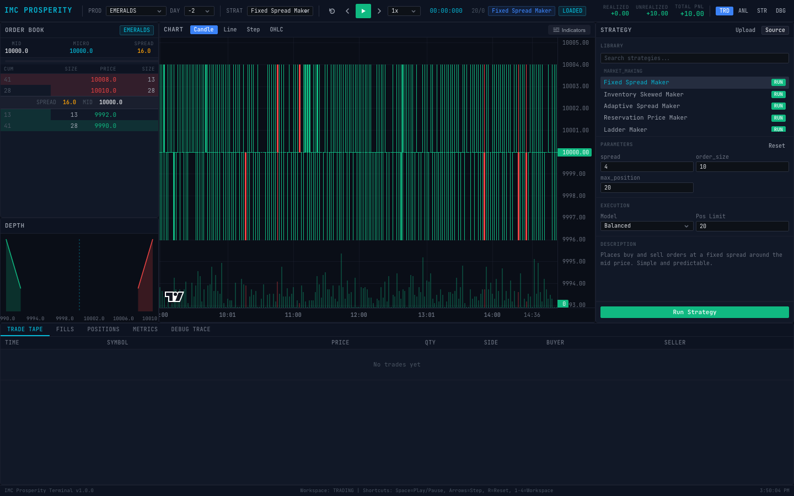

*Order book with 3 levels of bid/ask depth, spread indicator, depth chart visualisation, and live price chart with fill markers.*

The **Order Book** panel (top-left in Trading workspace) shows a ladder view of the current bid and ask levels:

```
ORDER BOOK          EMERALDS
─────────────────────────────────
BID                          ASK
─────────────────────────────────
          10000.0      16.0
CUM   SIZE   PRICE    SIZE   CUM
──────────────────────────────────
               10008.0   11
               10010.0   24
SPREAD: 16.0  MID: 10000.0
15      13    9992.0
30      24    9990.8
```

**Reading the order book:**

| Column | Meaning |
|---|---|
| **BID** (left side, green) | Buy orders — prices buyers are willing to pay |
| **ASK** (right side, red) | Sell orders — prices sellers are willing to accept |
| **SIZE** | Volume at that price level |
| **CUM** | Cumulative volume (total volume at and better than that level) |
| **SPREAD** | Difference between best ask and best bid |
| **MID** | Midpoint price = (best bid + best ask) / 2 |

The order book updates on every tick as new snapshots arrive. Up to 3 levels of depth are shown per side.

### 5. Using the Price Chart

The **Chart Panel** (center) displays price action using TradingView Lightweight Charts.

**Chart modes** (toggle via buttons above the chart):

| Mode | Description |
|---|---|
| **Candle** | Traditional Japanese candlestick chart (green = up, red = down) |
| **Line** | Continuous line connecting mid prices |
| **Step** | Step-function line (shows exact price levels between changes) |
| **OHLC** | Open-High-Low-Close bar chart |

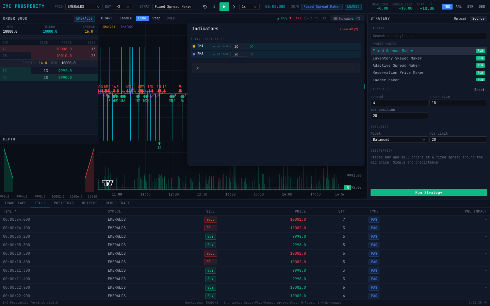

*Line chart mode showing continuous mid-price with SMA/EMA overlays and volume bars.*

**Chart features:**

- **Volume bars** at the bottom of the chart (green = up candle volume, red = down)
- **Fill markers** when a strategy is active: ▲ green triangles for BUY fills, ▼ red triangles for SELL fills
- **Crosshair** following your mouse with price/time readout
- **Auto-scaling** to fit visible data
- **Time axis** showing HH:MM format

**Interacting with the chart:**

- **Scroll** to zoom in/out on the time axis
- **Click and drag** to pan left/right
- **Double-click** to reset zoom
- The chart auto-scrolls to follow new data during replay

### 6. Adding Technical Indicators

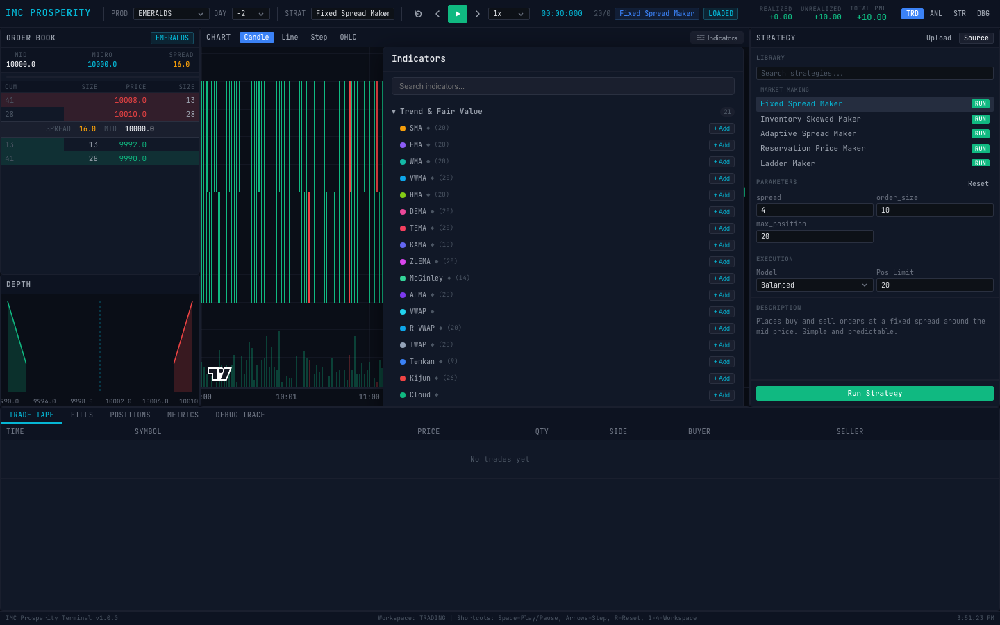

*The Indicator Selector panel showing 200+ indicators organized by category, each with configurable parameters and "+ Add" buttons.*

The terminal includes **200+ technical indicators** computed entirely on the client side for instant response.

**How to add indicators:**

1. Click the **Indicators** button in the chart panel header bar
2. The Indicator Selector panel opens, showing all available indicators organized by category
3. Browse categories or use the **Search** box to find an indicator
4. Each indicator shows its configurable **parameters** (e.g., SMA shows "period: 20")
5. **Adjust parameters** before adding: click the parameter value and type a new number
6. Click **+ Add** to add the indicator to the chart
7. The indicator appears immediately as an overlay on the chart (for trend indicators) or in a separate sub-pane below the chart (for oscillators)

**Active indicators** appear as **tags** in the chart header (e.g., `SMA(20)` `EMA(10)`). Click the **x** button on a tag to remove it.

**Adding multiple instances of the same indicator:**

You can add the same indicator type with different parameters. For example:
- SMA with period 5 (fast)
- SMA with period 20 (medium)
- SMA with period 50 (slow)

Each instance is tracked separately and displayed with a distinct color.

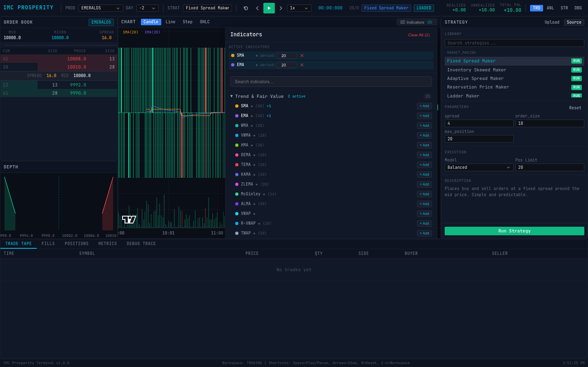

*Price chart with SMA(20) and EMA(20) indicator overlays. Active indicators shown as tags in the chart header.*

**Indicator categories and examples:**

| Category | Indicators | Display |
|---|---|---|
| **Trend & Fair Value** | SMA, EMA, WMA, VWMA, HMA, DEMA, TEMA, KAMA, ZLEMA, McGinley, ALMA, VWAP, Ichimoku, and more | Overlaid on price chart |
| **Oscillators** | RSI, Stochastic, Williams %R, CCI, MFI, Ultimate, Aroon, and more | Separate sub-pane with reference levels |
| **MACD Family** | MACD (line + signal + histogram), PPO, APO | Separate sub-pane |
| **Volatility & Bands** | Bollinger Bands (upper/mid/lower), ATR, Keltner Channels, Donchian Channels | Overlaid as bands / sub-pane |
| **Volume** | OBV, CMF, VWAP, Force Index, EMV, Volume Oscillator | Sub-pane |
| **Momentum** | ROC, Momentum, TSI, TRIX, KST, Coppock Curve | Sub-pane |
| **Custom** | Awesome Oscillator, Squeeze Momentum, Schaff Trend Cycle, Connors RSI, Mass Index, and more | Sub-pane |

**Oscillator reference levels:**

Oscillators like RSI automatically draw horizontal reference lines:
- **RSI**: Lines at 30 (oversold) and 70 (overbought)
- **Stochastic**: Lines at 20 and 80
- **CCI**: Lines at -100 and +100
- **MACD**: Zero line

### 7. Selecting and Running a Strategy

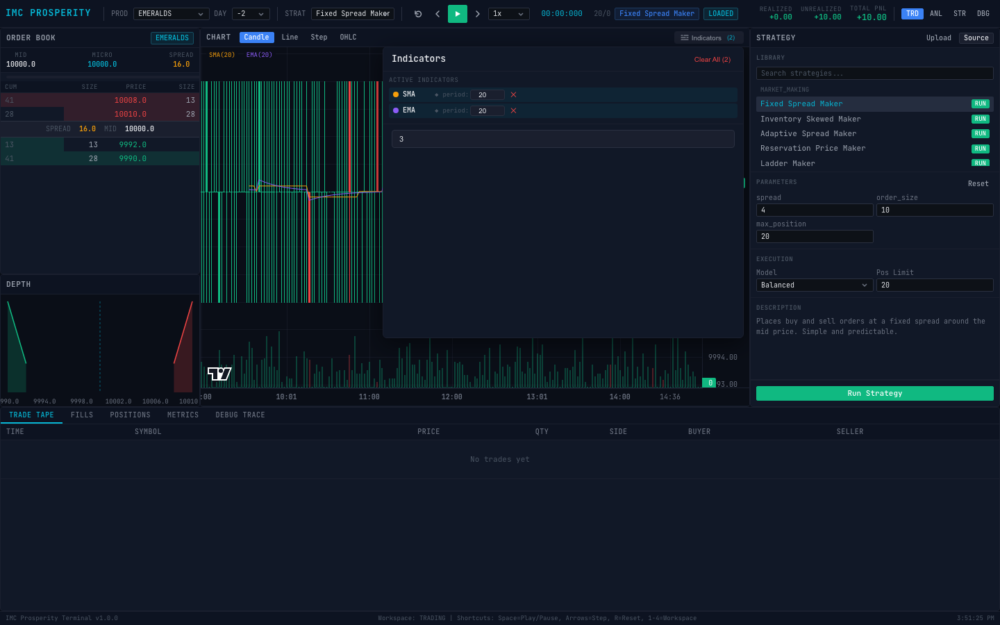

*Strategy workspace showing the library (left), selected strategy with parameters, execution model selector, and Run Strategy button.*

**Selecting a strategy for live replay:**

1. Use the **STRAT** dropdown in the header bar to select a strategy (e.g., "Fixed Spread Maker")
2. The strategy panel on the right side shows:
   - **Strategy name** highlighted in the library list
   - **Parameters** with editable fields (e.g., spread: 4, order_size: 10, max_position: 20)
   - **Execution model** dropdown (Conservative, Balanced, Optimistic)
   - **Position limit** setting
   - **Description** of what the strategy does
3. Modify parameters as desired
4. Press **Space** or click **Play** to start the replay with the strategy

When a strategy is active during replay:
- A **cyan badge** with the strategy name appears in the header
- The **LIVE** badge turns green
- **Fill markers** (▲ BUY / ▼ SELL) appear on the chart at execution points
- **PnL** updates in real-time in the header
- The **Positions** and **Fills** tabs populate with strategy data

**Running a backtest (strategy panel Run button):**

1. Select a strategy from the library (click on it in the Strategy panel)
2. Configure parameters, execution model, and position limit
3. Click the green **Run Strategy** button
4. The backtest executes against the loaded dataset
5. Results populate in:
   - **Metrics** tab: Sharpe ratio, max drawdown, win rate, profit factor, etc.
   - **Fills** tab: Every fill with timestamp, price, quantity, side
   - **Debug Trace** tab: Per-tick strategy state

### 8. Real-Time Strategy Replay (Live Mode)


*Live strategy replay: LIVE badge, Fixed Spread Maker strategy active, fill markers on chart, PnL updating in header, order book live, trade tape flowing.*

This is the most powerful feature &mdash; watching a strategy execute in real-time against historical data.

**Step by step:**

1. **Select product and day** using the PROD and DAY dropdowns
2. **Select a strategy** from the STRAT dropdown (e.g., "Fixed Spread Maker")
3. Press **Space** to play
4. Watch as:
   - The **order book** updates with each new snapshot
   - The **chart** draws new candles/bars progressively
   - **Fill markers** appear when the strategy executes trades (green ▲ = buy, red ▼ = sell)
   - The **header PnL** updates: Realized (closed trades), Unrealized (open positions), Total
   - The **trade tape** shows market trades
   - The **positions panel** shows current holdings with mark-to-market PnL
5. Press **Space** to pause at any point
6. Use **Right Arrow** to step one tick at a time for detailed analysis
7. Switch to the **Debug** workspace (press `4`) to see per-tick strategy decisions

**What you'll see in the header:**

```
REALIZED: +25.50   UNREALIZED: -10.00   TOTAL: +15.50
```

- **Realized PnL**: Profit/loss from closed positions (both sides traded)
- **Unrealized PnL**: Mark-to-market value of open positions (current price vs entry price)
- **Total PnL**: Realized + Unrealized
- Values are **color-coded**: green for positive, red for negative

### 9. Reading the PnL Header

The PnL display in the header bar shows three values:

| Field | Meaning | Example |
|---|---|---|
| **REALIZED** | Profit from closed round-trip trades | +25.50 (green) |
| **UNREALIZED** | Paper profit/loss on open positions | -10.00 (red) |
| **TOTAL** | Sum of realized + unrealized | +15.50 (green) |

These values update in real-time during replay with a strategy active.

### 10. Viewing Positions


*Positions panel showing active holdings with quantity, average entry price, mark price, unrealized/realized PnL, and position limits.*

Click the **POSITIONS** tab in the bottom panel to see current holdings.

The positions table shows:

| Column | Meaning |
|---|---|
| **PRODUCT** | Instrument name (e.g., EMERALDS) |
| **QTY** | Current position quantity (positive = long, negative = short) |
| **AVG ENTRY** | Average entry price of the position |
| **MARK** | Current market price (mid price) |
| **UNREAL.** | Unrealized PnL = (mark - avg_entry) × qty |
| **REAL.** | Realized PnL from round-trip trades |
| **POS. LIMIT** | Maximum allowed position size |

The positions panel also shows a **summary row** at the top:
```
POSITIONS: 1   UNREALIZED: +10.00   REALIZED: +0.00   TOTAL PNL: +10.00   CASH: 0.00
```

**Active positions** (qty ≠ 0) are shown first, followed by **flat positions** that have realized PnL from previously closed trades.

### 11. Viewing Fills


*Fills panel showing every strategy execution: timestamp, symbol, side (BUY/SELL), price, quantity, type (PAS/AGG), and PnL impact.*

Click the **FILLS** tab to see every trade execution.

| Column | Meaning |
|---|---|
| **TIME** | Timestamp of the fill |
| **SYMBOL** | Product traded |
| **SIDE** | BUY or SELL |
| **PRICE** | Execution price |
| **QTY** | Number of units filled |
| **TYPE** | PAS (passive/resting) or AGG (aggressive/crossing) |
| **PNL IMPACT** | PnL contribution of this fill |

### 12. Running a Backtest

A backtest runs a strategy against the full dataset and computes comprehensive performance metrics.

**Via the UI:**

1. Switch to **Strategy** workspace (press `3`)
2. Click on a strategy in the library (e.g., "Bollinger Band Reversion")
3. Adjust parameters if desired
4. Set execution model (Conservative recommended for realistic results)
5. Set position limit
6. Click **Run Strategy**
7. Wait for completion
8. Results appear in the **Metrics**, **Fills**, and **Debug Trace** tabs

**Via the API:**

```bash
# Run a backtest
curl -X POST http://localhost:8000/api/strategies/fixed_spread_maker/run \
  -H "Content-Type: application/json" \
  -d '{
    "products": ["EMERALDS"],
    "days": [-2],
    "execution_model": "BALANCED",
    "position_limits": {"EMERALDS": 20},
    "fees": 0,
    "slippage": 0,
    "initial_cash": 0
  }'

# Get backtest results
curl http://localhost:8000/api/backtest/{run_id}/metrics

# Get all fills
curl http://localhost:8000/api/backtest/{run_id}/fills

# Get PnL history
curl http://localhost:8000/api/backtest/{run_id}/pnl

# Get debug trace (paginated)
curl "http://localhost:8000/api/backtest/{run_id}/trace?offset=0&limit=50"
```

### 13. Analysing Backtest Metrics

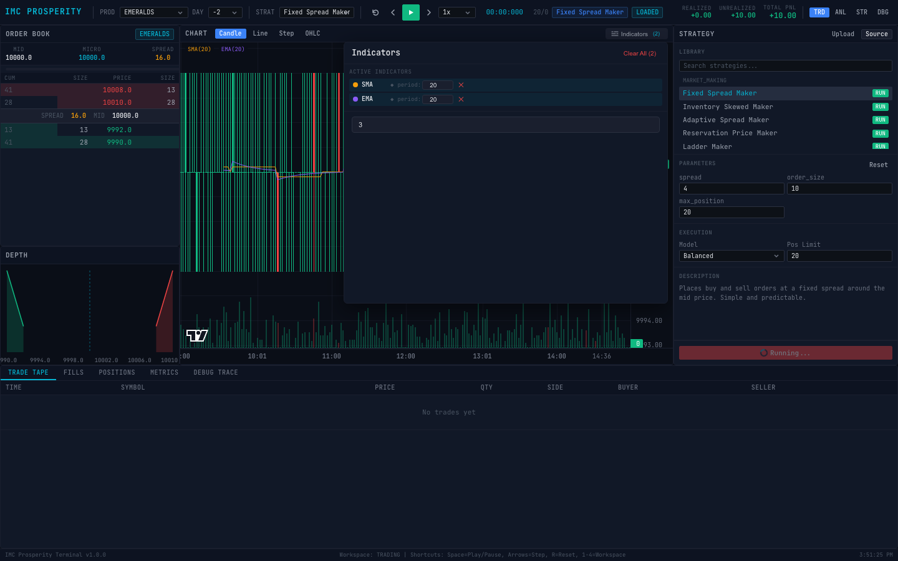

*Backtest results showing performance metrics: Total PnL, Sharpe ratio, max drawdown, win rate, profit factor, and PnL curve.*

After running a backtest, click the **METRICS** tab. The metrics panel displays:

| Metric | Description |
|---|---|
| **Total PnL** | Final profit or loss |
| **Realized PnL** | PnL from closed positions |
| **Unrealized PnL** | PnL from open positions at end |
| **Sharpe Ratio** | Risk-adjusted return (higher = better, >1 is good) |
| **Max Drawdown** | Largest peak-to-trough decline |
| **Win Rate** | Percentage of winning trades |
| **Profit Factor** | Gross profit / gross loss (>1 means profitable) |
| **Avg Win** | Average profit on winning trades |
| **Avg Loss** | Average loss on losing trades |
| **Num Trades** | Total number of round-trip trades |
| **Total Volume** | Total units traded |
| **Total Fees** | Total transaction fees paid |

A **PnL sparkline** chart shows the cumulative PnL curve over time.

### 14. Using the Debug Trace

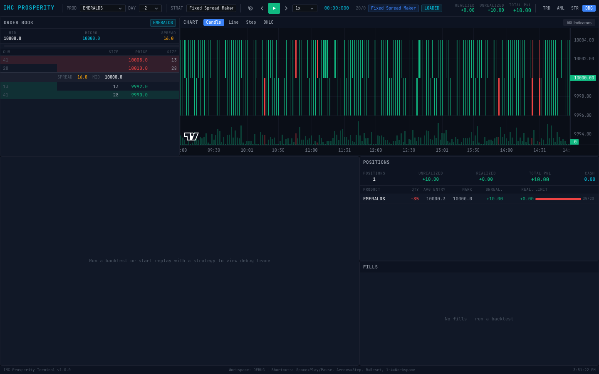

*Debug workspace: order book + chart (top), per-tick debug trace (bottom-left), positions with mark-to-market PnL (bottom-center), fill history (bottom-right).*

The **DEBUG TRACE** tab shows per-tick strategy decision data. Switch to the **Debug** workspace (press `4`) for the best view.

Each row in the debug trace represents one replay tick:

| Column | Description |
|---|---|
| **TIMESTAMP** | Event time |
| **EVENT** | Event type (ORDER, FILL, SNAPSHOT) |
| **ORDERS** | Orders submitted by the strategy at this tick |
| **FILLS** | Fills that occurred at this tick |
| **PNL** | Running PnL at this tick |
| **NOTES** | Strategy-specific debug output |

**Features:**
- **Search** box to filter trace entries
- **Auto-scroll** toggle to follow new entries
- **Event type filter** dropdown (ALL, ORDER, FILL, etc.)
- **LIVE** badge and frame counter showing progress

### 15. Uploading a Custom Strategy

You can upload your own Python strategy files to test against the historical data.

**Via the UI:**

1. Open the **Strategy** workspace (press `3`)
2. Click the **Upload** button in the strategy panel
3. Select a `.py` file from your computer
4. The file is validated to ensure it contains a compatible `Trader` class
5. If valid, it appears in the strategy library and can be selected/run immediately

**Via the API:**

```bash
curl -X POST http://localhost:8000/api/strategies/upload \
  -H "Content-Type: application/json" \
  -d '{
    "name": "My Custom Strategy",
    "source_code": "class Trader:\n    def run(self, state):\n        # Your strategy logic here\n        return [], 0, \"\"\n"
  }'
```

**Strategy file format:**

Your strategy file must contain a `Trader` class with a `run` method:

```python
class Trader:
    def run(self, state):
        """
        Called once per tick with the current market state.

        Args:
            state: Object with attributes:
                - order_depth: dict of {product: OrderDepth}
                  OrderDepth has .buy_orders (dict price->qty)
                                 .sell_orders (dict price->qty)
                - position: dict of {product: int}
                - own_trades: dict of {product: [Trade]}
                - market_trades: dict of {product: [Trade]}
                - observations: dict
                - timestamp: int

        Returns:
            tuple of (orders_dict, conversions, trader_data)
            - orders_dict: {product: [Order(product, price, quantity)]}
              Positive quantity = BUY, negative = SELL
            - conversions: int (usually 0)
            - trader_data: str (persisted between calls)
        """
        orders = {}
        return orders, 0, ""
```

See `sample_strategies/` for complete examples:
- `simple_market_maker.py` &mdash; Places orders at a fixed spread around the mid price
- `mean_reversion_example.py` &mdash; Buys below the rolling mean, sells above

### 16. Switching Workspaces

The terminal has 4 workspace layouts optimised for different tasks:

| Key | Workspace | Best For |
|---|---|---|
| `1` | **Trading** | Day-to-day monitoring: order book + chart + strategy panel + tabbed bottom |
| `2` | **Analysis** | Chart analysis: large chart with metrics sidebar |
| `3` | **Strategy** | Strategy development: wide strategy panel + chart + tabs |
| `4` | **Debug** | Debugging: order book + chart (top) / debug trace + positions + fills (bottom) |

Click the workspace buttons (**TRD**, **ANL**, **STR**, **DBG**) in the header or press keys `1`-`4`.

All panels in every workspace are **resizable** &mdash; drag the dividers between panels to customise the layout.

### 17. Keyboard Shortcuts

| Key | Action |
|---|---|
| `Space` | Play / Pause replay |
| `Right Arrow` | Step forward one tick |
| `Shift + Right Arrow` | Seek forward ~10 ticks |
| `Left Arrow` | Step backward one tick |
| `Shift + Left Arrow` | Seek backward ~10 ticks |
| `R` | Reset replay to beginning |
| `1` | Switch to Trading workspace |
| `2` | Switch to Analysis workspace |
| `3` | Switch to Strategy workspace |
| `4` | Switch to Debug workspace |

**Note:** Keyboard shortcuts are disabled when the cursor is inside an input field, textarea, or dropdown to prevent conflicts while typing.

---

## Workspace Layouts

### Trading Workspace (Press `1`)


```
┌───────────┬────────────────────────────────┬──────────────────┐
│ ORDER     │         PRICE CHART            │   STRATEGY       │
│ BOOK      │  (candle/line/step/OHLC)       │   PANEL          │
│           │  + indicator overlays           │   • Library      │
│ Bid/Ask   │  + fill markers                │   • Params       │
│ ladder    │  + volume bars                 │   • Exec model   │
│           │                                │   • Run button   │
├───────────┤                                │                  │
│ DEPTH     │                                │                  │
│ CHART     │                                │                  │
├───────────┴────────────────────────────────┴──────────────────┤
│ [TRADE TAPE] [FILLS] [POSITIONS] [METRICS] [DEBUG TRACE]      │
└───────────────────────────────────────────────────────────────┘
```

### Analysis Workspace (Press `2`)

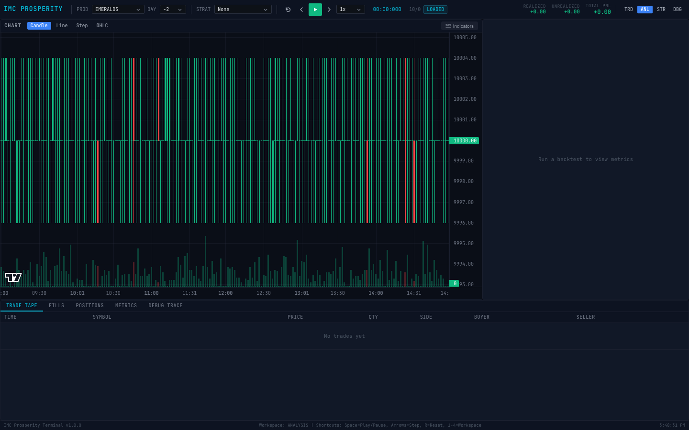

```
┌────────────────────────────────────────────┬──────────────────┐
│              PRICE CHART                   │   METRICS        │
│         (large, full-width chart)          │   PANEL          │
│                                            │                  │
│  + indicators + fills + volume             │  (or: "Run a     │
│                                            │   backtest to    │
│                                            │   view metrics") │
├────────────────────────────────────────────┴──────────────────┤
│ [TRADE TAPE] [FILLS] [POSITIONS] [METRICS] [DEBUG TRACE]      │
└───────────────────────────────────────────────────────────────┘
```

### Strategy Workspace (Press `3`)

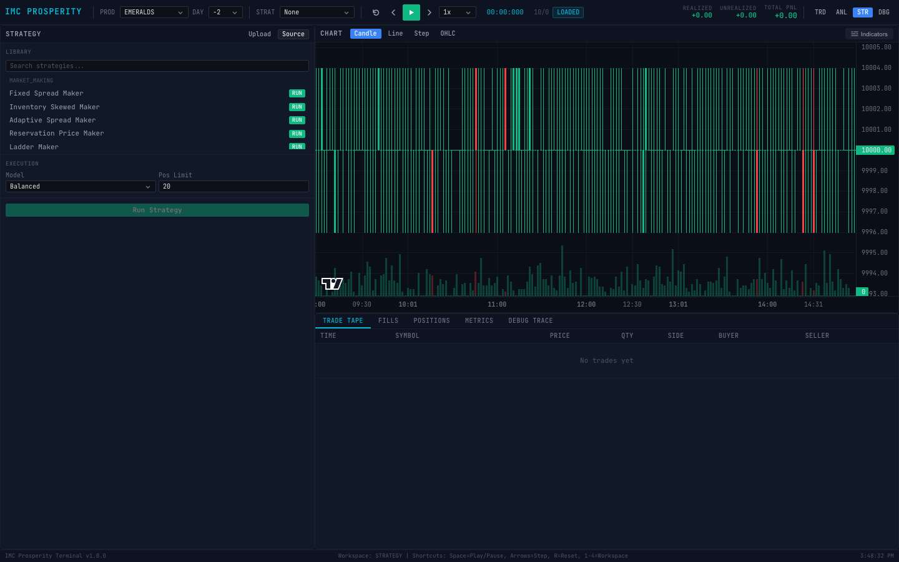

```
┌──────────────────┬────────────────────────────────────────────┐
│ STRATEGY PANEL   │              PRICE CHART                   │
│ (wide)           │                                            │
│ • Library list   │  + indicators + fills + volume             │
│ • Params editor  │                                            │
│ • Source viewer  │                                            │
│ • Upload button  │                                            │
│ • Run button     │                                            │
├──────────────────┴────────────────────────────────────────────┤
│ [TRADE TAPE] [FILLS] [POSITIONS] [METRICS] [DEBUG TRACE]      │
└───────────────────────────────────────────────────────────────┘
```

### Debug Workspace (Press `4`)

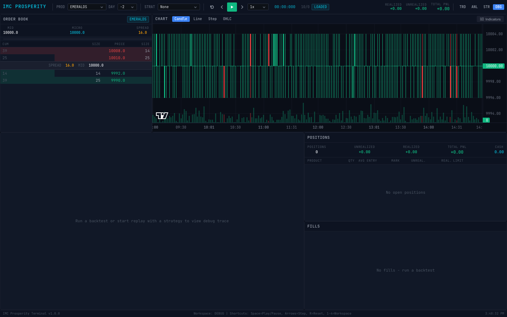

```
┌───────────┬───────────────────────────────────────────────────┐
│ ORDER     │              PRICE CHART                          │
│ BOOK      │  (compact view with fills)                        │
├───────────┴──────────────────┬────────────────────────────────┤
│ DEBUG TRACE                  │  POSITIONS                     │
│ Per-tick strategy output     │  Current holdings + PnL        │
│ • Timestamp, event, orders   ├────────────────────────────────┤
│ • Fills, PnL, notes         │  FILLS                         │
│ • Search + filter            │  Execution history             │
│ • Auto-scroll                │  Time, side, price, qty, type  │
└──────────────────────────────┴────────────────────────────────┘
```

---

## Technical Indicators (200+)

All indicators are computed client-side in the browser for instant updates. Each indicator has configurable parameters that you set before adding.

### Trend & Fair Value (Overlay on Price Chart)

| Indicator | Parameters | Description |
|---|---|---|
| **SMA** | period (default: 20) | Simple Moving Average |
| **EMA** | period (default: 20) | Exponential Moving Average |
| **WMA** | period (default: 20) | Weighted Moving Average |
| **VWMA** | period (default: 20) | Volume Weighted Moving Average |
| **HMA** | period (default: 20) | Hull Moving Average (smoother, less lag) |
| **DEMA** | period (default: 20) | Double Exponential Moving Average |
| **TEMA** | period (default: 20) | Triple Exponential Moving Average |
| **KAMA** | period (default: 20) | Kaufman Adaptive Moving Average |
| **ZLEMA** | period (default: 20) | Zero-Lag Exponential Moving Average |
| **McGinley** | period (default: 14) | McGinley Dynamic (auto-adjusting MA) |
| **ALMA** | period (default: 20) | Arnaud Legoux Moving Average |
| **VWAP** | &mdash; | Volume Weighted Average Price (no parameters) |
| **P-VWAP** | period (default: 14) | Periodic VWAP |
| **T3/V** | period (default: 20) | Tillson T3 Moving Average |
| **Ichimoku** | tenkan (9), kijun (26) | Ichimoku Cloud conversion line |
| **KiJun** | period (default: 26) | Kijun-Sen base line |
| **Cloud** | &mdash; | Ichimoku Cloud (Senkou Span A & B) |

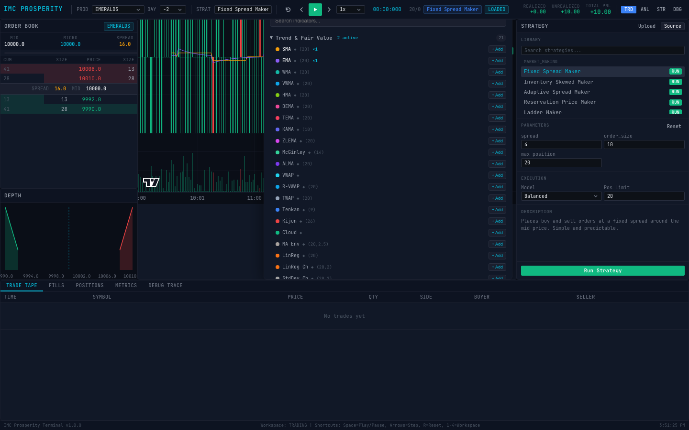

*Scrolled indicator list showing oscillator and volume categories with configurable parameters.*

### Oscillators (Separate Sub-Pane)

| Indicator | Parameters | Reference Levels |
|---|---|---|
| **RSI** | period (default: 14) | 30 (oversold), 70 (overbought) |
| **Stochastic** | k (14), d (3) | 20, 80 |
| **StochRSI** | period (default: 14) | 20, 80 |
| **Williams %R** | period (default: 14) | -80, -20 |
| **CCI** | period (default: 20) | -100, +100 |
| **MFI** | period (default: 14) | 20, 80 |
| **Ultimate** | s (7), m (14), l (28) | 30, 70 |
| **Aroon** | period (default: 25) | 30, 70 |
| **DPO** | period (default: 20) | 0 |
| **CMO** | period (default: 14) | -50, +50 |

### MACD Family (Sub-Pane with Histogram)

| Indicator | Parameters | Display |
|---|---|---|
| **MACD** | fast (12), slow (26), signal (9) | Line + signal + histogram |
| **PPO** | fast (12), slow (26), signal (9) | Percentage Price Oscillator |
| **APO** | fast (12), slow (26) | Absolute Price Oscillator |

### Volatility & Bands

| Indicator | Parameters | Display |
|---|---|---|
| **Bollinger** | period (20), mult (2.0) | Upper/middle/lower bands on chart |
| **ATR** | period (default: 14) | Sub-pane |
| **Keltner** | period (20), mult (2.0) | Channel bands on chart |
| **Donchian** | period (default: 20) | High/low channel on chart |
| **BBWidth** | period (20), mult (2.0) | Bollinger Band width (sub-pane) |

### Volume Indicators (Sub-Pane)

| Indicator | Parameters | Description |
|---|---|---|
| **OBV** | &mdash; | On Balance Volume |
| **CMF** | period (default: 20) | Chaikin Money Flow |
| **Force** | period (default: 13) | Force Index |
| **EMV** | period (default: 14) | Ease of Movement |
| **VO** | fast (12), slow (26) | Volume Oscillator |

### Momentum (Sub-Pane)

| Indicator | Parameters | Description |
|---|---|---|
| **ROC** | period (default: 12) | Rate of Change |
| **Momentum** | period (default: 10) | Price Momentum |
| **TSI** | long (25), short (13) | True Strength Index |
| **TRIX** | period (default: 15) | Triple EMA oscillator |
| **KST** | r1-r4 + sigPeriod | Know Sure Thing |
| **Coppock** | longRoc, shortRoc, wma | Coppock Curve |

### Specialty Indicators

| Indicator | Parameters | Description |
|---|---|---|
| **AO** | fast (5), slow (34) | Awesome Oscillator |
| **AC** | fast (5), slow (34) | Accelerator Oscillator |
| **Squeeze** | bbPeriod, kcPeriod, mult | Squeeze Momentum |
| **CRSI** | rsiPeriod, streakPeriod, rankPeriod | Connors RSI |
| **Schaff** | fast (23), slow (50), cycle (10) | Schaff Trend Cycle |
| **Mass Index** | emaPeriod (9), sumPeriod (25) | Mass Index |
| **ADX** | period (default: 14) | Average Directional Index |
| **Vortex** | period (default: 14) | Vortex Indicator (VI+ / VI-) |
| **SuperTrend** | period (10), mult (3.0) | SuperTrend trend-following |
| **ParabolicSAR** | step (0.02), max (0.2) | Parabolic Stop & Reverse |
| **ZigZag** | pct (default: 5) | ZigZag swing detection |
| **Hurst** | period (default: 100) | Hurst Exponent |
| **Fisher** | period (default: 10) | Fisher Transform |
| **Ehlers** | period (default: 20) | Ehlers Filter |

*...and many more. Use the search bar in the Indicator Selector to find any specific indicator.*

---

## Built-in Strategy Library (17 Strategies)

### Market Making (5 Strategies)

| Strategy | Description | Key Parameters |
|---|---|---|
| **Fixed Spread Maker** | Places buy and sell orders at a fixed spread around the mid price. Simple, predictable baseline. | spread: 4, order_size: 10, max_position: 20 |
| **Inventory Skewed Maker** | Adjusts quotes based on current inventory. Skews price away from accumulated position to reduce risk. | base_spread: 4, order_size: 10, max_position: 20, skew_factor: 0.5 |
| **Adaptive Spread Maker** | Widens spread during high volatility, tightens during calm markets. Uses rolling mid-price std dev. | min_spread: 2, max_spread: 8, order_size: 10, max_position: 20, volatility_window: 20 |
| **Reservation Price Maker** | Avellaneda-Stoikov inspired. Computes optimal reservation price accounting for inventory risk. | Uses mathematical framework to set spread |
| **Ladder Maker** | Places multiple orders at different price levels around fair value, creating a ladder of liquidity. | Multiple levels on both sides |

### Mean Reversion (4 Strategies)

| Strategy | Description | Key Parameters |
|---|---|---|
| **Mid Price Mean Reversion** | Trades when mid price deviates from its rolling mean by a configurable number of standard deviations. | window: 20, entry_threshold: 2.0, exit_threshold: 0.5, order_size: 10 |
| **Bollinger Band Reversion** | Buys at the lower Bollinger Band and sells at the upper band. Unwinds near the mean. | window: 20, num_std: 2.0, order_size: 10, max_position: 20 |
| **Z-Score Reversion** | Trades based on the z-score of the current price relative to its rolling mean. | window: 30, entry_z: 2.0, exit_z: 0.5, order_size: 10 |
| **VWAP Reversion** | Reverts to the Volume-Weighted Average Price. Buys below VWAP, sells above. | Uses trade data for VWAP computation |

### Momentum (5 Strategies)

| Strategy | Description | Key Parameters |
|---|---|---|
| **EMA Crossover** | Buys when fast EMA crosses above slow EMA, sells on reverse crossover. | fast_period: 5, slow_period: 20, order_size: 10, max_position: 20 |
| **SMA Crossover** | Buys when fast SMA crosses above slow SMA, sells on reverse crossover. | fast_period: 5, slow_period: 20, order_size: 10, max_position: 20 |
| **Breakout Strategy** | Buys on new highs over a lookback window, sells on new lows. | lookback: 20, order_size: 10, max_position: 20 |
| **Momentum Strategy** | Trades based on rolling return momentum over a lookback window. | Direction follows price momentum |
| **Trade Flow Momentum** | Follows net trade flow direction. Buys on net buying pressure, sells on selling pressure. | Analyses aggressor side of trades |

### Microstructure (3 Strategies)

| Strategy | Description | Key Parameters |
|---|---|---|
| **Imbalance Follower** | Trades in the direction of order book imbalance. Buys when bids dominate asks. | imbalance_threshold: 0.3, order_size: 10, max_position: 20 |
| **Spread Capture** | Places passive orders to capture the bid-ask spread. Only trades when spread is wide enough. | min_spread: 2, order_size: 5, max_position: 15 |
| **Tradeburst Reaction** | Detects bursts of trades and follows the direction of net volume in the burst. | Tracks trade frequency and direction |

---

## Execution Models

Because Prosperity data consists of periodic **order book snapshots** (not a continuous event stream), the terminal must model how passive orders would be filled. Three models are available:

### Conservative

- Only **aggressive fills** are guaranteed
- Passive orders fill **only** when an actual trade print exists at or better than the resting price
- Fill quantity capped at qualifying trade volume
- **Most realistic** &mdash; use this for strategy evaluation

### Balanced (Default)

- Passive fills use trade-flow evidence **plus** book-movement heuristics
- A resting order fills if:
  - A trade occurs at/through the price (same as Conservative), **OR**
  - The opposing best quote moves through the resting price
- **Reasonable middle ground** for development

### Optimistic

- A passive order fills whenever the market price merely **touches** the resting level
- **Overstates fill probability** &mdash; useful only as an upper bound
- If a strategy is profitable only under Optimistic execution, it's likely not robust

**Recommendation:** Run the same strategy under all three models to establish a confidence interval on real-world performance.

---

## Data Format Reference

### Price Snapshots CSV

**Filename:** `prices_round_{N}_day_{D}.csv`

**Delimiter:** Semicolon (`;`) preferred; comma (`,`) fallback supported.

| Column | Type | Required | Description |
|---|---|---|---|
| `day` | int | Yes | Trading day identifier |
| `timestamp` | int | Yes | Tick timestamp |
| `product` | str | Yes | Product symbol (e.g., AMETHYSTS) |
| `bid_price_1` | float | Yes | Best bid price |
| `bid_volume_1` | int | Yes | Volume at best bid |
| `ask_price_1` | float | Yes | Best ask price |
| `ask_volume_1` | int | Yes | Volume at best ask |
| `mid_price` | float | Yes | Mid price |
| `bid_price_2`, `bid_volume_2` | float, int | No | Second-level bid |
| `bid_price_3`, `bid_volume_3` | float, int | No | Third-level bid |
| `ask_price_2`, `ask_volume_2` | float, int | No | Second-level ask |
| `ask_price_3`, `ask_volume_3` | float, int | No | Third-level ask |
| `profit_and_loss` | float | No | Cumulative PnL at snapshot |

### Trade Prints CSV

**Filename:** `trades_round_{N}_day_{D}.csv`

**Delimiter:** Semicolon (`;`) preferred; comma (`,`) fallback supported.

| Column | Type | Required | Description |
|---|---|---|---|
| `timestamp` | int | Yes | Trade timestamp |
| `buyer` | str | Yes | Buyer identifier |
| `seller` | str | Yes | Seller identifier |
| `symbol` | str | Yes | Product symbol |
| `currency` | str | Yes | Currency (e.g., SEASHELLS) |
| `price` | float | Yes | Trade price |
| `quantity` | int | Yes | Trade quantity |

---

## API Reference

### Health & Data

| Method | Endpoint | Description |
|---|---|---|
| GET | `/api/health` | Health check |
| GET | `/api/datasets` | List loaded dataset metadata |
| POST | `/api/datasets/load` | Load/reload datasets from data directory |
| GET | `/api/products` | List all product names |
| GET | `/api/days` | List all available days |
| GET | `/api/snapshots?product=X&day=Y` | Get order book snapshots |
| GET | `/api/trades?product=X&day=Y` | Get trade prints |
| GET | `/api/ohlcv?product=X&interval=N&day=Y` | Get OHLCV bars |
| GET | `/api/indicators?product=X&indicator=sma&period=20&day=Y` | Compute indicator |

### Replay Control

| Method | Endpoint | Description |
|---|---|---|
| POST | `/api/replay/start` | Start replay (body: `{products, days, strategy_id?}`) |
| POST | `/api/replay/step` | Step forward one event |
| POST | `/api/replay/step-back` | Step backward one event |
| POST | `/api/replay/pause` | Pause replay |
| POST | `/api/replay/seek` | Seek to timestamp (body: `{timestamp}`) |
| POST | `/api/replay/speed` | Set playback speed (body: `{speed}`) |
| GET | `/api/replay/state` | Get current replay state |
| POST | `/api/replay/reset` | Reset to initial state |
| POST | `/api/replay/jump-next-trade` | Jump to next trade event |
| POST | `/api/replay/jump-next-fill` | Jump to next fill event |

### Strategies

| Method | Endpoint | Description |
|---|---|---|
| GET | `/api/strategies` | List all strategies |
| GET | `/api/strategies/{id}` | Get strategy details |
| GET | `/api/strategies/{id}/source` | Get strategy source code |
| POST | `/api/strategies/upload` | Upload custom strategy (body: `{name, source_code}`) |
| POST | `/api/strategies/{id}/run` | Run strategy backtest |

### Backtest Results

| Method | Endpoint | Description |
|---|---|---|
| GET | `/api/backtest/{run_id}` | Get run summary |
| GET | `/api/backtest/{run_id}/metrics` | Get performance metrics |
| GET | `/api/backtest/{run_id}/trace?offset=0&limit=50` | Get paginated debug trace |
| GET | `/api/backtest/{run_id}/fills` | Get all fills |
| GET | `/api/backtest/{run_id}/pnl` | Get PnL history |
| GET | `/api/backtest/{run_id}/export?format=json` | Export full run data |
| GET | `/api/runs` | List all backtest runs |
| POST | `/api/runs/compare` | Compare runs (body: `{run_ids}`) |

### WebSocket

| Endpoint | Description |
|---|---|
| `ws://localhost:8000/api/ws/replay` | Live replay streaming |

WebSocket commands (send as JSON):
```json
{"action": "play"}
{"action": "pause"}
{"action": "speed", "value": 5.0}
{"action": "step"}
{"action": "step_back"}
```

---

## Strategy Interface (Writing Custom Strategies)

Custom strategies must follow the IMC Prosperity protocol. Create a Python file with a `Trader` class:

```python
class Trader:
    """Your custom trading strategy."""

    def run(self, state):
        """
        Called once per market tick.

        Parameters
        ----------
        state : TradingState
            state.order_depth : dict
                {product: OrderDepth}
                OrderDepth.buy_orders : dict[int, int]  # price -> volume (positive)
                OrderDepth.sell_orders : dict[int, int]  # price -> volume (negative)

            state.position : dict
                {product: int}  # current position (can be negative for short)

            state.own_trades : dict
                {product: [Trade]}  # your fills since last tick

            state.market_trades : dict
                {product: [Trade]}  # all market trades since last tick

            state.timestamp : int
                Current tick timestamp

            state.observations : dict
                External observations (competition-specific)

        Returns
        -------
        tuple of (orders, conversions, trader_data)
            orders : dict
                {product: [Order(product, price, quantity)]}
                Positive quantity = BUY, Negative quantity = SELL

            conversions : int
                Number of conversions (usually 0)

            trader_data : str
                JSON string persisted between calls (for state tracking)
        """
        result = {}

        for product in state.order_depth:
            order_depth = state.order_depth[product]
            orders = []

            # Example: buy at best bid - 1, sell at best ask + 1
            if order_depth.buy_orders:
                best_bid = max(order_depth.buy_orders.keys())
                orders.append(Order(product, best_bid - 1, 5))  # BUY 5 units

            if order_depth.sell_orders:
                best_ask = min(order_depth.sell_orders.keys())
                orders.append(Order(product, best_ask + 1, -5))  # SELL 5 units

            result[product] = orders

        return result, 0, ""
```

### Sample Strategies

Two complete example strategies are provided in `sample_strategies/`:

**`simple_market_maker.py`** &mdash; Places symmetric buy/sell orders at a fixed distance from the mid price. Demonstrates basic order book access and order placement.

**`mean_reversion_example.py`** &mdash; Maintains a rolling window of mid prices. Buys when price drops below the mean by a threshold, sells when it rises above. Demonstrates using `trader_data` for state persistence between ticks.

---

## Project Structure

```
Visualiser-IMC/
├── backend/
│   ├── requirements.txt                        # Python dependencies
│   └── app/
│       ├── main.py                             # FastAPI entry point, CORS, router mounting
│       ├── core/
│       │   ├── config.py                       # Settings (env vars, CORS, data directory)
│       │   └── deps.py                         # Dependency injection (singleton services)
│       ├── models/
│       │   ├── market.py                       # MarketSnapshot, TradePrint, OrderBook
│       │   ├── trading.py                      # StrategyOrder, FillEvent
│       │   ├── strategy.py                     # Strategy metadata
│       │   ├── backtest.py                     # BacktestConfig, BacktestRun
│       │   ├── analytics.py                    # PerformanceMetrics, ExecutionMetrics
│       │   └── events.py                       # Event models
│       ├── api/
│       │   ├── datasets.py                     # /api/datasets, /api/products, /api/days, etc.
│       │   ├── replay.py                       # /api/replay/* endpoints
│       │   ├── backtest.py                     # /api/backtest/* endpoints
│       │   ├── strategies.py                   # /api/strategies/* endpoints
│       │   └── websocket.py                    # /api/ws/replay WebSocket
│       ├── engines/
│       │   ├── data/
│       │   │   ├── loader.py                   # CSV discovery and parsing
│       │   │   ├── normalizer.py               # Type normalization
│       │   │   └── aggregator.py               # OHLCV bar aggregation
│       │   ├── replay/
│       │   │   ├── engine.py                   # Market replay (step, seek, cursor)
│       │   │   └── state.py                    # Replay session state (books, trades)
│       │   ├── execution/
│       │   │   └── engine.py                   # Order fill simulation (3 models)
│       │   ├── backtest/
│       │   │   └── engine.py                   # Backtest orchestration
│       │   ├── sandbox/
│       │   │   ├── runner.py                   # Strategy sandbox with timeout
│       │   │   └── adapter.py                  # Prosperity protocol adapter
│       │   ├── orderbook/
│       │   │   ├── book.py                     # Order book construction from snapshots
│       │   │   └── metrics.py                  # Spread, imbalance, microprice
│       │   ├── analytics/
│       │   │   ├── indicators.py               # Backend indicator computation
│       │   │   └── execution_analytics.py      # Execution quality analysis
│       │   └── strategies/
│       │       ├── registry.py                 # Strategy auto-discovery registry
│       │       ├── market_making.py            # 5 market making strategies
│       │       ├── mean_reversion.py           # 4 mean reversion strategies
│       │       ├── momentum.py                 # 5 momentum strategies
│       │       └── microstructure.py           # 3 microstructure strategies
│       ├── services/
│       │   ├── dataset_service.py              # Data loading orchestration
│       │   ├── replay_service.py               # Replay + strategy integration
│       │   ├── backtest_service.py             # Backtest execution
│       │   └── strategy_service.py             # Strategy management
│       ├── storage/
│       │   └── database.py                     # SQLite persistence
│       └── tests/                              # pytest test suite
│           ├── test_api.py
│           ├── test_backtest.py
│           ├── test_data_loader.py
│           ├── test_execution.py
│           ├── test_models.py
│           ├── test_orderbook.py
│           ├── test_replay.py
│           ├── test_sandbox.py
│           └── test_analytics.py
├── frontend/
│   ├── package.json                            # Node.js dependencies
│   ├── vite.config.ts                          # Vite build configuration
│   ├── tsconfig.json                           # TypeScript configuration
│   ├── index.html                              # HTML entry point
│   └── src/
│       ├── main.tsx                            # React entry point
│       ├── app/
│       │   └── App.tsx                         # Root component (init, replay loop)
│       ├── types/
│       │   └── index.ts                        # All TypeScript interfaces
│       ├── store/
│       │   └── index.ts                        # Zustand stores (5 stores)
│       ├── services/
│       │   └── api.ts                          # HTTP + WebSocket API client
│       ├── hooks/
│       │   ├── useKeyboardShortcuts.ts         # Keyboard shortcut handler
│       │   └── useWebSocket.ts                 # WebSocket connection hook
│       ├── components/
│       │   ├── Header.tsx                      # Top header bar with all controls
│       │   └── IndicatorSelector.tsx           # Indicator picker with parameter editor
│       ├── layouts/
│       │   └── TerminalLayout.tsx              # 4 workspace layout definitions
│       ├── panels/
│       │   ├── OrderBookPanel.tsx              # Order book ladder view
│       │   ├── DepthChartPanel.tsx             # Visual depth chart
│       │   ├── ChartPanel.tsx                  # Main price chart + indicators
│       │   ├── TradeTapePanel.tsx              # Real-time trade tape
│       │   ├── StrategyPanel.tsx               # Strategy library + config
│       │   ├── MetricsPanel.tsx                # Performance metrics display
│       │   ├── DebugTracePanel.tsx             # Per-tick debug output
│       │   ├── FillsPanel.tsx                  # Fill history table
│       │   └── PositionsPanel.tsx              # Position tracking table
│       ├── utils/
│       │   ├── indicators.ts                   # 200+ indicator computation functions
│       │   └── indicatorRegistry.ts            # Indicator metadata + parameter definitions
│       └── styles/
│           └── global.css                      # CSS custom properties theme
├── sample_data/                                # Included sample market data
│   ├── prices_round_0_day_-1.csv
│   ├── prices_round_0_day_-2.csv
│   ├── trades_round_0_day_-1.csv
│   └── trades_round_0_day_-2.csv
├── sample_strategies/                          # Example strategy files
│   ├── simple_market_maker.py
│   └── mean_reversion_example.py
├── docs/                                       # Additional documentation
│   ├── strategy-interface.md
│   ├── execution-model.md
│   ├── ui-guide.md
│   └── development.md
└── storage/                                    # SQLite database (created at runtime)
```

---

## Tech Stack

### Backend

| Component | Technology | Version |
|---|---|---|
| Web Framework | FastAPI | 0.109 |
| ASGI Server | Uvicorn | 0.27 |
| Data Validation | Pydantic | 2.5 |
| Configuration | pydantic-settings | 2.1 |
| Data Processing | pandas | 2.1 |
| Numerical Computing | NumPy | 1.26 |
| WebSocket | websockets | 12.0 |
| File Uploads | python-multipart | 0.0.6 |
| Async File I/O | aiofiles | 23.2 |
| Testing | pytest + pytest-asyncio | 7.4 / 0.23 |
| HTTP Testing | httpx | 0.26 |

### Frontend

| Component | Technology | Version |
|---|---|---|
| UI Library | React | 18.2 |
| Language | TypeScript | 5.2 |
| Build Tool | Vite | 5.0 |
| State Management | Zustand | 4.4 |
| Charting | Lightweight Charts (TradingView) | 4.1 |
| Layout | react-resizable-panels | 1.0 |
| Styling | CSS Custom Properties (no Tailwind) | &mdash; |

---

## Troubleshooting

### "Connection failed" error banner

**Cause:** Frontend cannot reach the backend API.

**Fix:**
1. Ensure the backend is running: `curl http://localhost:8000/api/health`
2. If using a custom port, set `VITE_API_BASE_URL` accordingly
3. Check for CORS issues in the browser console (the backend allows all origins by default)

### Order book shows "No data - start replay"

**Cause:** No replay session is active.

**Fix:** Select a product and day, then press Space or click Play to start.

### Chart is empty / no candles

**Cause:** Not enough data points for the chart to render.

**Fix:** Step forward several ticks (hold Right Arrow) or let the replay play for a few seconds.

### Strategy fills not appearing

**Cause:** No strategy selected, or the strategy hasn't produced any orders yet.

**Fix:**
1. Select a strategy from the STRAT dropdown in the header
2. Reset (press R) and play again
3. Some strategies only trade after accumulating enough data (e.g., mean reversion needs a full lookback window)

### PnL shows +0.00 / +0.00 / +0.00

**Cause:** Strategy hasn't executed any trades yet, or PnL data isn't flowing.

**Fix:**
1. Let the replay run longer &mdash; some strategies need many ticks before their first trade
2. Check the Debug Trace (press 4) to see if the strategy is generating orders

### Indicators not showing on chart

**Cause:** No indicators have been added.

**Fix:**
1. Click the "Indicators" button in the chart header
2. Click "+ Add" next to the desired indicator
3. Ensure there are enough data points (indicators need their lookback period filled first)

### WebSocket errors in console

**Cause:** `[WS] Error: Event` messages are harmless reconnection attempts.

**Fix:** These can be safely ignored. The frontend automatically reconnects.

### Backend startup fails with import errors

**Cause:** Missing Python dependencies.

**Fix:**
```bash
cd backend
pip install -r requirements.txt
```

### Frontend build fails

**Cause:** Missing Node.js dependencies.

**Fix:**
```bash
cd frontend
rm -rf node_modules
npm install
```

---

## Limitations

| Limitation | Impact |
|---|---|
| **Snapshot-based data** | Source data provides periodic order book snapshots, not a full Level 3 feed. Events between snapshots are unobserved. |
| **Reconstructed OHLCV** | Candlestick bars are built from mid-price snapshots, not actual trade prices. This introduces approximation. |
| **Modeled queue position** | The execution engine cannot determine actual queue priority for passive orders. Fill assumptions depend on the execution model. |
| **3-level depth** | Only up to 3 levels of depth per side are available from the CSV data. Deeper liquidity is unknown. |
| **Strategy timeout** | User-uploaded strategies have a 1-second execution timeout per tick call. |
| **Single-product replay** | The replay focuses on one product at a time (selected via PROD dropdown). |

---

## How to Extend

### Add a New Product

Products are auto-discovered from CSV column values. Just include the new product in your data files and reload.

### Add a New Round/Day

Follow the naming convention and place files in the data directory:
```
prices_round_1_day_0.csv
trades_round_1_day_0.csv
```

### Add a Built-in Strategy

1. Create a class in the appropriate module under `backend/app/engines/strategies/`
2. Implement the `run(self, state)` method
3. Add a `StrategyDefinition` entry with ID, name, category, description, source code, and parameter metadata
4. The registry auto-discovers it on startup

### Add a New Technical Indicator

1. Add the computation function to `frontend/src/utils/indicators.ts`
2. Register it in `frontend/src/utils/indicatorRegistry.ts` with:
   - Unique key
   - Display name
   - Category
   - Parameter definitions (name, default value)
   - Pane type (overlay or sub-pane)
   - Line count and reference levels
3. Add the computation case to `ChartPanel.tsx`'s `computeIndicator` switch

### Add a New Data Adapter

Create a new loader class following the pattern in `backend/app/engines/data/loader.py`. Implement `discover_datasets`, schema validation, and CSV parsing. Wire it into the dataset service.

---

## License

MIT
